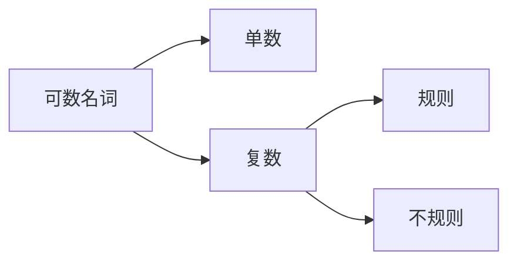
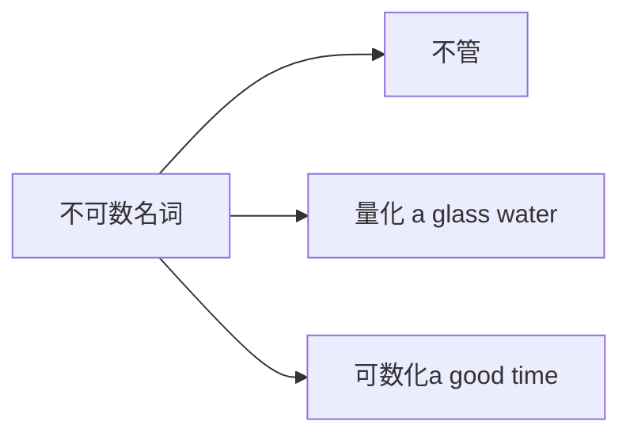

英语基础语法
> 英语语法，重塑语法体系

1. [1. 句子成分](#1-句子成分)
    1. [1.1. 名词](#11-名词)
        1. [1.1.1. 可数名词和不可数名词](#111-可数名词和不可数名词)
        2. [1.1.2. 代词](#112-代词)
            1. [1.1.2.1. 人称代词](#1121-人称代词)

# 1. 句子成分
首先就要明白的一个概念就是句子，从中文的语义上理解，就是能过表达一个完整的意思或者一个概念，如果从文章结构来看，两个句号“**.**”的东西就可以成为一个句子。

最典型的错误就是按照长短句来划分句子，但实际上**time flys**. 就是一个完整的句子。而如下面这句话**一个头发长的，头发黑色的，直头发的女孩**是一个短语
用一个公式来描述就是**句子=主语(n)+谓语(v)**

## 1.1. 名词
名词可以可以细分为6种

使用公式描述就是**名词=限定词+修饰词+主体词**
限定词主要有七种构成

1. 冠词  a/an the
2. 形容词性物主代词 my his her···
3. 名词所有格  one's
4. 指示代词  this that
5. 不定代词 some any 
6. 基数词 one two three
7. 疑问代词 what which
   
| 限定词 | 修饰词 |         主体词         |
| :----: | :----: | :--------------------: |
|   a    |  good  |          boy           |
|   a    |        |          boy           |
|        |  good  |  boys（可数名词复数）  |
|        |        |  boys（可数名词复数）  |
|        |  good  | news（不可数名词复数） |
|        |        |   China（专有名词）    |
|        |        |    Tom（专有名词）     |
|  the   |  rich  |   ~~people~~（笼统）   |
|  the   |  best  |  ~~student~~（明显）   |
| these  |        |       ~~books~~        |
>总结：名词部分，限定词、修饰词、主题词三个部分都可以省略，只要能够表达明确的意思。

### 1.1.1. 可数名词和不可数名词
可数名词与不可数名词的区别并不是常规意义上的能不能够数的问题，而是好数不好数的问题。
对于常规名词，如书，课本，可以很明显的分辨出来是可数名词还是不可数名词，而对于不容易区分的名词，如chicken，当作鸡的时候可以很明显的数出来一只鸡两只鸡，而当作鸡肉，由于没有固定的形态，就只能作为不可数名词。

### 1.1.2. 代词
>代词人称代词，指示代词，不定代词，疑问代词

#### 1.1.2.1. 人称代词

| 主格  | 宾格 | 形容词性物主代词 | 名词性物主代词 | 反身代词 |
| :---: |:---:|:---:|:---:|:---:|
|I|me|my|mine|myself|
|you|you|your|yours|yourself|
|he|him|his|his|himself|
|she|her|her|hers|herself|
|it|it|its|its|itself|
|we|us|out|ours|ourselves|
|you|you|your|yours|yourselves|
|they|them|their|theirs|themselves|

3333333