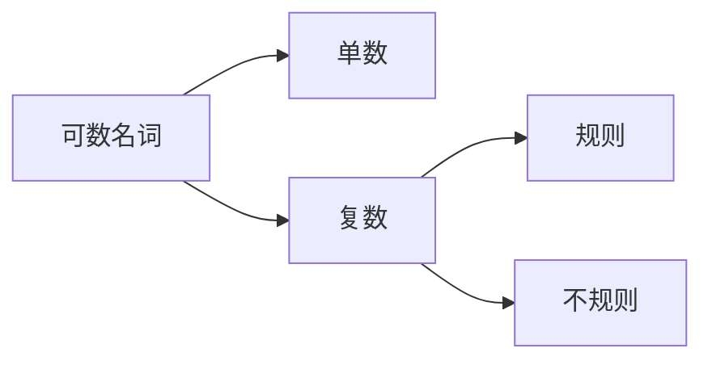
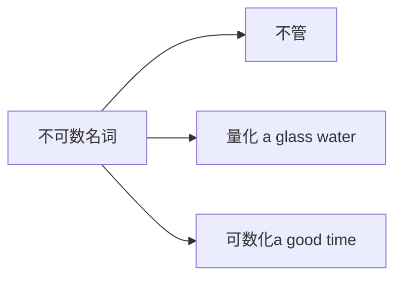
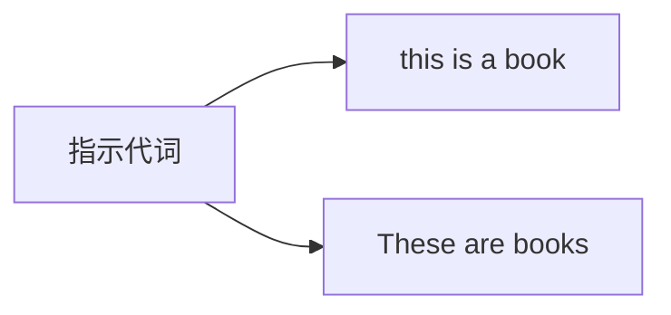
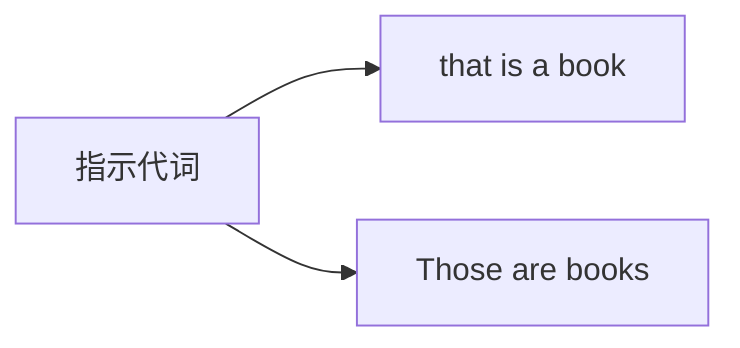
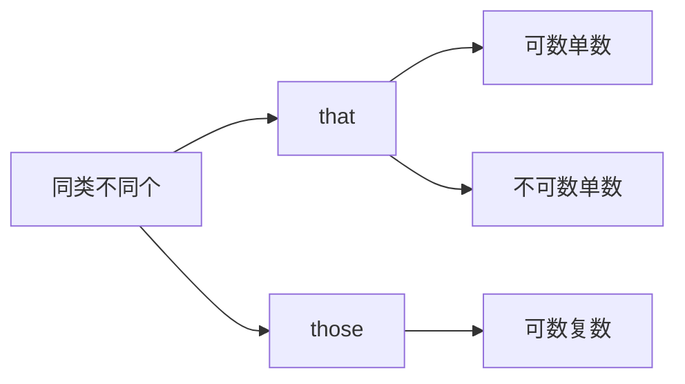
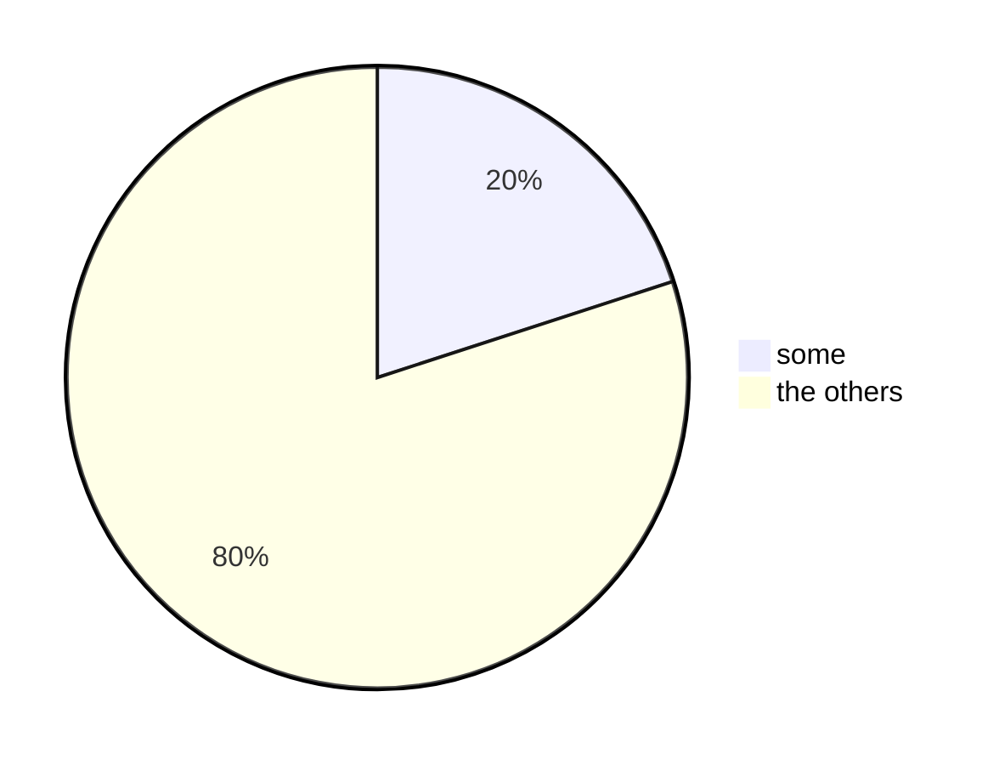
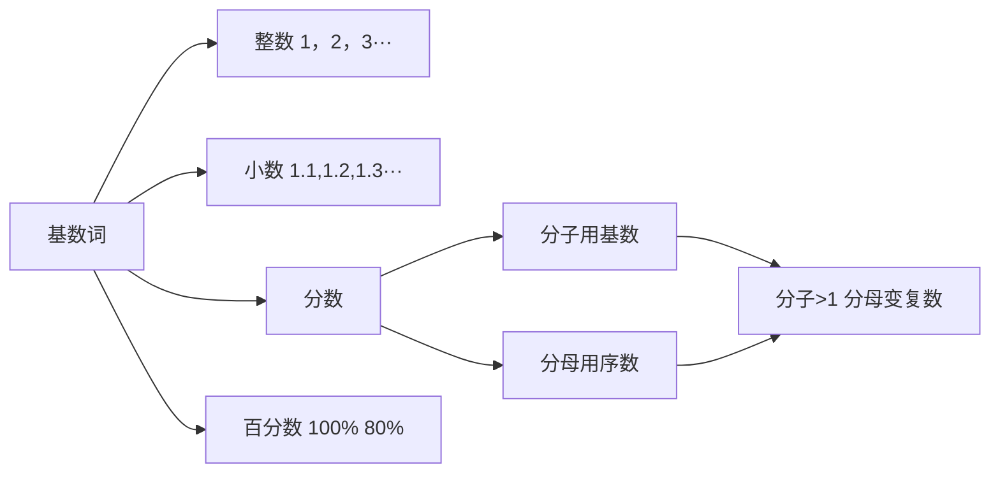
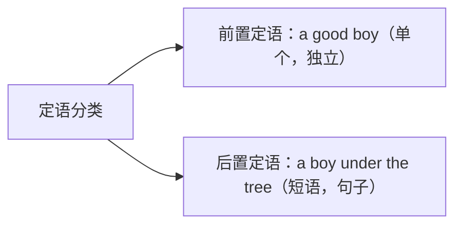
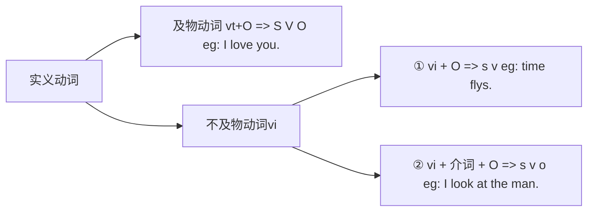

英语基础语法
> 英语语法，重塑语法体系

1. [1. 句子成分](#1-句子成分)
    1. [1.1. 名词(狭义名词)](#11-名词狭义名词)
        1. [1.1.1. 可数名词和不可数名词](#111-可数名词和不可数名词)
    2. [1.2. 广义名词](#12-广义名词)
        1. [1.2.1. 不定式](#121-不定式)
        2. [1.2.2. 动名词](#122-动名词)
        3. [1.2.3. 句子](#123-句子)
    3. [1.3. 代词](#13-代词)
        1. [1.3.1. 人称代词](#131-人称代词)
        2. [1.3.2. 指示代词](#132-指示代词)
        3. [1.3.3. 不定代词](#133-不定代词)
            1. [1.3.3.1. other相关语法](#1331-other相关语法)
        4. [1.3.4. 疑问代词](#134-疑问代词)
    4. [1.4. 数词](#14-数词)
        1. [1.4.1. 基数词 one,two,three···](#141-基数词-onetwothree)
        2. [1.4.2. 序数词 first,second,third](#142-序数词-firstsecondthird)
    5. [1.5. 定语](#15-定语)
    6. [1.6. 动词](#16-动词)
        1. [1.6.1. 动词分类](#161-动词分类)
        2. [1.6.2. 实义动词（行为动词）[表具体动作]](#162-实义动词行为动词表具体动作)
        3. [1.6.3. 系动词 + 表语（表示主语是什么或怎么样）[不表具体动作]](#163-系动词--表语表示主语是什么或怎么样不表具体动作)

# 1. 句子成分
首先就要明白的一个概念就是句子，从中文的语义上理解，就是能过表达一个完整的意思或者一个概念，如果从文章结构来看，两个句号“**.**”的东西就可以成为一个句子。

最典型的错误就是按照长短句来划分句子，但实际上**time flys**. 就是一个完整的句子。而如下面这句话**一个头发长的，头发黑色的，直头发的女孩**是一个短语
用一个公式来描述就是**句子=主语(n)+谓语(v)**

## 1.1. 名词(狭义名词)
名词可以可以细分为6种

使用公式描述就是**名词=限定词+修饰词+主体词**
限定词主要有七种构成

1. 冠词  a/an the
2. 形容词性物主代词 my his her···
3. 名词所有格  one's
4. 指示代词  this that
5. 不定代词 some any 
6. 基数词 one two 
7. 疑问代词 what which
   
| 限定词 | 修饰词 |         主体词         |
| :----: | :----: | :--------------------: |
|   a    |  good  |          boy           |
|   a    |        |          boy           |
|        |  good  |  boys（可数名词复数）  |
|        |        |  boys（可数名词复数）  |
|        |  good  | news（不可数名词复数） |
|        |        |   China（专有名词）    |
|        |        |    Tom（专有名词）     |
|  the   |  rich  |   ~~people~~（笼统）   |
|  the   |  best  |  ~~student~~（明显）   |
| these  |        |       ~~books~~        |
>总结：名词部分，限定词、修饰词、主题词三个部分都可以省略，只要能够表达明确的意思。

### 1.1.1. 可数名词和不可数名词
可数名词与不可数名词的区别并不是常规意义上的能不能够数的问题，而是好数不好数的问题。
对于常规名词，如书，课本，可以很明显的分辨出来是可数名词还是不可数名词，而对于不容易区分的名词，如chicken，当作鸡的时候可以很明显的数出来一只鸡两只鸡，而当作鸡肉，由于没有固定的形态，就只能作为不可数名词。

## 1.2. 广义名词
### 1.2.1. 不定式
To learn English well **is very important**. 
It is very important to learn English well.
### 1.2.2. 动名词
Smoking **is bad**.
### 1.2.3. 句子
That you are a pig **is a fact**.  
It is a fact that you are a pig.
>总结：1. 作主语看作单数 &emsp;&emsp;&emsp;2.“头重脚轻”时，用it作形式主语/形式宾语
## 1.3. 代词
>代词人称代词，指示代词，不定代词，疑问代词

### 1.3.1. 人称代词

| 主格S | 宾格 O | 形容词性物主代词adj+n | 名词性物主代词 |  反身代词  |
| :---: | :----: | :-------------------: | :------------: | :--------: |
|   I   |   me   |          my           |      mine      |   myself   |
|  you  |  you   |         your          |     yours      |  yourself  |
|  he   |  him   |          his          |      his       |  himself   |
|  she  |  her   |          her          |      hers      |  herself   |
|  it   |   it   |          its          |      its       |   itself   |
|  we   |   us   |          out          |      ours      | ourselves  |
|  you  |  you   |         your          |     yours      | yourselves |
| they  |  them  |         their         |     theirs     | themselves |

1. 主格作主语 
    eg：I like english.
2. 宾格作宾语（o）或者表语（p）  
    eg: I hate him. 
        &emsp;&nbsp;&nbsp;It is me.
3. 形容词性物主代词+名词=名词性物主代词 
    eg: This is my book. 
        &emsp;&nbsp;&nbsp;This book is my book.
4. 反身代词得先有该人称 
    eg: I love her. 
        &emsp;&nbsp;&nbsp;I love myself. 
        &emsp;&nbsp;&nbsp;~~I love herself.~~

### 1.3.2. 指示代词
>this, these, that, those

### 1.3.3. 不定代词
#### 1.3.3.1. other相关语法

1. other[限定词，adj] + n（可数名词复数） = others
   >这里对于复数的理解做一个解释：想象一个情景，当有人问你“其他人呢”的时候，这个时候需要使用**其他人**，你还看过**其他的**书或者电影吗？

   >other如果想要接可数名词单数或者不可数名词，需要在前面加上**no** **any** **every**这些直接表明只有一个或者没有的限定词 

   >otherr 不能单独用 &emsp; I have other. &#10006; 
   >&emsp;&emsp;&emsp;&emsp;&emsp;&emsp;&emsp;&emsp;&emsp;&ensp;I have others.&ensp;&#10004;

   >others 泛指其他人或者其他物,如果要特指就需要使用the others 
   >some students··· ; other students··· 
   >这里表示一些学生···，另一些学生···，其实学生可以作很多事，没有确切指定。而英语中又不喜欢重复，这个时候就可以使用**others**来代替**other students**
2. the others 表示特指

有20个学生喜欢打游戏，除去这20个剩下80个学生都喜欢学习。这个时候就可以表示···like play games, the others like study.

3. the other：表示两个单位中的另一个，经常使用的搭配为**one···the other···** 第一种情况可以理解为互斥，除了这个就是那个，两个天生对立 第二种情况可以理解为泛指，可以理解为一个集合中的两个不同部分，如人类的生殖性别，除了男人就是女人。 

4. another: 表示另一个，在原有的基础上再加一个。可以想一下吃东西的时候觉得很好就，就跟老板说我想要再来一份，这个时候就可以说**I want another one.**

5.other + than 除了···（否定）=except
> The truth was known to no one other than herself. 

 
### 1.3.4. 疑问代词
who is he? 
>He is who
what do you want?
>You want what

## 1.4. 数词
### 1.4.1. 基数词 one,two,three···

eg: $\frac{1}{3}$ one third  &emsp;&nbsp;&nbsp;$\frac{2}{3}$ two thirds

### 1.4.2. 序数词 first,second,third

## 1.5. 定语
定语的在句子中起装饰作用，具体点描述就是把一个名词从大变小，从笼统到具体。

举个详细的例子，网购的东西的时候需要填收获地址，一般都是从某某省某某市某某区某某街道某某小区某某栋某某楼然后再加上门牌号。从大到小范围逐渐缩小。

当我们描述一个苹果的时候，我们会说：“这是一个苹果。”，但我们不知道这个苹果是什么样子的，我们可以说这是一个老巫婆给的，白雪公主吃了会睡着的，睡着之后会遇到白马王子和七个小矮人的**苹果**，这样描述下来苹果这个过于笼统的概念就被限定在了某一个范围内。

## 1.6. 动词
### 1.6.1. 动词分类
1. 助动词（起辅助作用，不能单独构成谓语）
    1. Be 动词 am is are was were be
    2. 情态动词
   &nbsp;
can could

   &nbsp;
will would

   &nbsp;
shall should

   &nbsp;
may might

   &nbsp;
must have to

   &nbsp;
need dare

   
   |   1.不单独使用   | 2.+do（动词原型） |
   | :--------------: | :---------------: |
   | **3.无人称变化** | **4.有本身含义**  |

    1. 侠义助动词
   do does dis
    2. 完成助动词
   have has
### 1.6.2. 实义动词（行为动词）[表具体动作] 

### 1.6.3. 系动词 + 表语（表示主语是什么或怎么样）[不表具体动作]

表状态：be, stay，keep

表感官：feel，smell，taste， look，sound

表变化：become， go，get， turn, fall

表像：seem， appear

   
   
